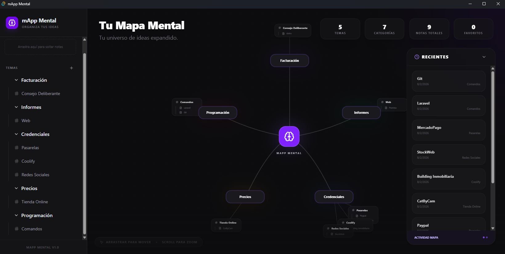
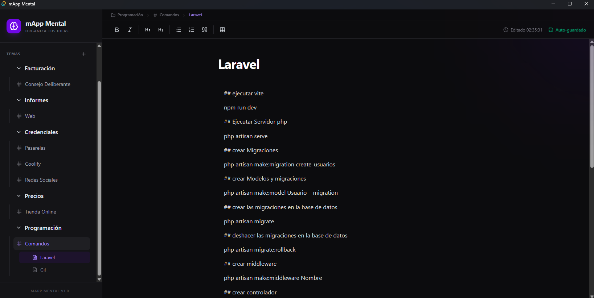

# mApp-Mental 🧠

**mApp-Mental** es una aplicación de escritorio moderna y minimalista diseñada para organizar ideas, temas y categorías de forma visual y eficiente. Construida con un enfoque en la experiencia de usuario y el rendimiento, permite gestionar notas dentro de un sistema estructurado de "Temas" y "Categorías".

## 🚀 Tecnologías Utilizadas

Tecnologías del ecosistema web y de escritorio:

- **[Tauri 2](https://tauri.app/)**: Framework para construir aplicaciones de escritorio ultraligeras y seguras con Rust.
- **[React 19](https://react.dev/)**: Biblioteca para construir interfaces de usuario de forma declarativa.
- **[Bun](https://bun.sh/)**: Runtime de JavaScript extremadamente rápido que utilizamos para la gestión de paquetes y ejecución de scripts.
- **[TypeScript](https://www.typescriptlang.org/)**: Para un desarrollo robusto y tipado.
- **[Tailwind CSS 4](https://tailwindcss.com/)**: Motor de estilos de última generación para un diseño moderno y fluido.
- **[Zustand](https://zustand-demo.pmnd.rs/)**: Gestión de estado ligera y escalable con persistencia local.
- **[Tiptap](https://tiptap.dev/)**: Editor de texto enriquecido moderno y extensible.
- **[Framer Motion](https://www.framer.com/motion/)**: Biblioteca para animaciones fluidas y gestos.
- **[Lucide React](https://lucide.dev/)**: Set de iconos hermosos y consistentes.

## 📸 Capturas de Pantalla

A continuación se muestran algunas capturas de la aplicación en funcionamiento:


*Interfaz principal de mApp-Mental*


*Gestión de temas y categorías*

## ✨ Características Principales

- 📁 **Organización Jerárquica**: Crea Temas, dentro de ellos Categorías, y finalmente Notas.
- 📝 **Editor de Texto Enriquecido**: Edita tus notas con herramientas potentes gracias a Tiptap.
- 🎨 **Interfaz Moderna**: Animaciones suaves y diseño minimalista basado en Tailwind CSS.
- 💾 **Persistencia Automática**: Tus datos se guardan localmente para que nunca pierdas nada.
- ⚡ **Extremadamente Rápida**: Gracias al runtime de Bun y el motor de Tauri.

## 🛠️ Instalación y Uso

Asegúrate de tener instalados [Bun](https://bun.sh/) y las [dependencias de Tauri](https://tauri.app/v1/guides/getting-started/prerequisites) en tu sistema.

### 1. Clonar el repositorio e instalar dependencias

```bash
bun install
```

### 2. Ejecutar en modo desarrollo

```bash
bun run tauri dev
```

### 3. Compilar para producción (Build)

```bash
bun run tauri build
```

---
Desarrollado con ❤️ para organizar tus notas mentales.
